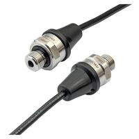
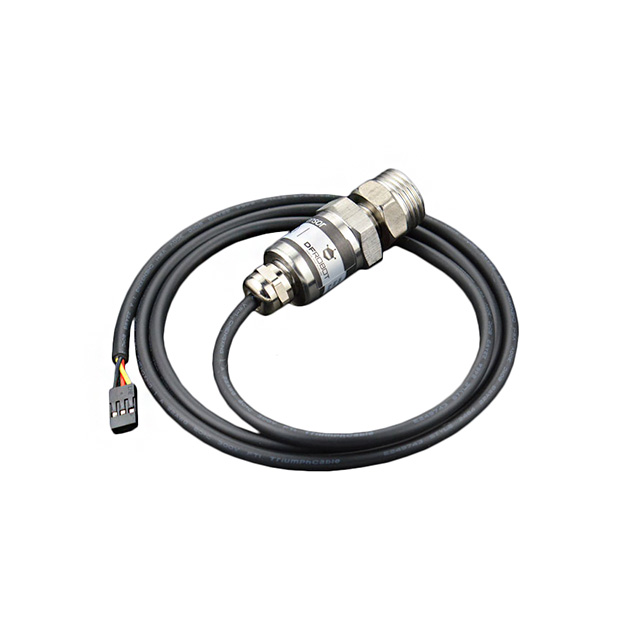

---
Title | Component Selection for Pressure Sensor Subsystem
---

### Primary Components

*Table 1:  Pressure Sensor Selection*

| **Solution**                                                                                                                                                                                      | **Pros**                                                                                                                                    | **Cons**                                                                                            |
| ------------------------------------------------------------------------------------------------------------------------------------------------------------------------------------------------- | ------------------------------------------------------------------------------------------------------------------------------------------- | --------------------------------------------------------------------------------------------------- |
|  Option 1 -   Angst+Pfister Sensors and Power AG PEWA3403 $49.00/each [link to product](https://www.digikey.com/en/products/detail/angst-pfister-sensors-and-power-ag/PEWA3403-0-0-6-MPa-V6WB2C2/22511405)                 | \* Robust industrial design \* Handles a wide range of pressures \* Offers pressure control features                                               | \* Relatively expensive \* Overbuilt for simple pressure monitoring. |
|    Option 2 -   \* DFRobot Gravity Analog Water Pressure Sensor  \* $17.50/each  \* [Link to product](https://www.digikey.com/en/products/detail/dfrobot/SEN0257/8341836?s=N4IgTCBcDaIOYCcCGA3AlgFwJ4AIDuSGApgjgA4JEDOVArpTlUQHZUD2CIAugL5A) | \* Cost effective  \* Handles a greater range of pressure than competitors at the price point   \* Stable output voltage across pressure range | * Datasheet lacks some depth on sensor construction  \* Requires additional thread on main pipe to take measurement |

**Choice:** Option 2: DFRobot Gravity Analog Water Pressure Sensor

**Rationale:** This sensor leaves greater room in the budget while providing readings for a wider range of pressure. The output voltage works well with easily accesible voltage regulators and there are additional resources on the application of the sensor using other controllers. Given the compatability with similar sized controllers the lack of depth with dimensions can be navigable. This sensor advertises no corrosion and offers clear information on the thread size in the datasheet. 

### Style 2

> Also acceptable, more markdown friendly

**External Clock Module**

1. XC1259TR-ND surface mount crystal

    

    * $1/each
    * [link to product](http://www.digikey.com/product-detail/en/ECS-40.3-S-5PX-TR/XC1259TR-ND/827366)

    | Pros                                      | Cons                                                             |
    | ----------------------------------------- | ---------------------------------------------------------------- |
    | Inexpensive                               | Requires external components and support circuitry for interface |
    | Compatible with PSoC                      | Needs special PCB layout.                                        |
    | Meets surface mount constraint of project |

1. CTX936TR-ND surface mount oscillator

    

    * $1/each
    * [Link to product](http://www.digikey.com/product-detail/en/636L3I001M84320/CTX936TR-ND/2292940)

    | Pros                                                              | Cons                |
    | ----------------------------------------------------------------- | ------------------- |
    | Outputs a square wave                                             | More expensive      |
    | Stable over operating temperature                                 | Slow shipping speed |
    | Direct interface with PSoC (no external circuitry required) range |

**Choice:** Option 2: CTX936TR-ND surface mount oscillator

**Rationale:** A clock oscillator is easier to work with because it requires no external circuitry in order to interface with the PSoC. This is particularly important because we are not sure of the electrical characteristics of the PCB, which could affect the oscillation of a crystal. While the shipping speed is slow, according to the website if we order this week it will arrive within 3 weeks.
