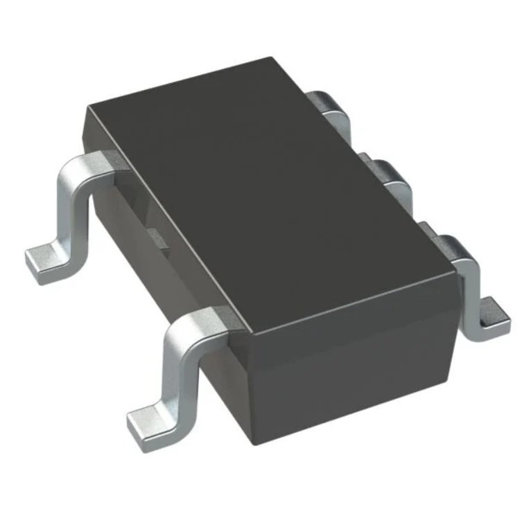
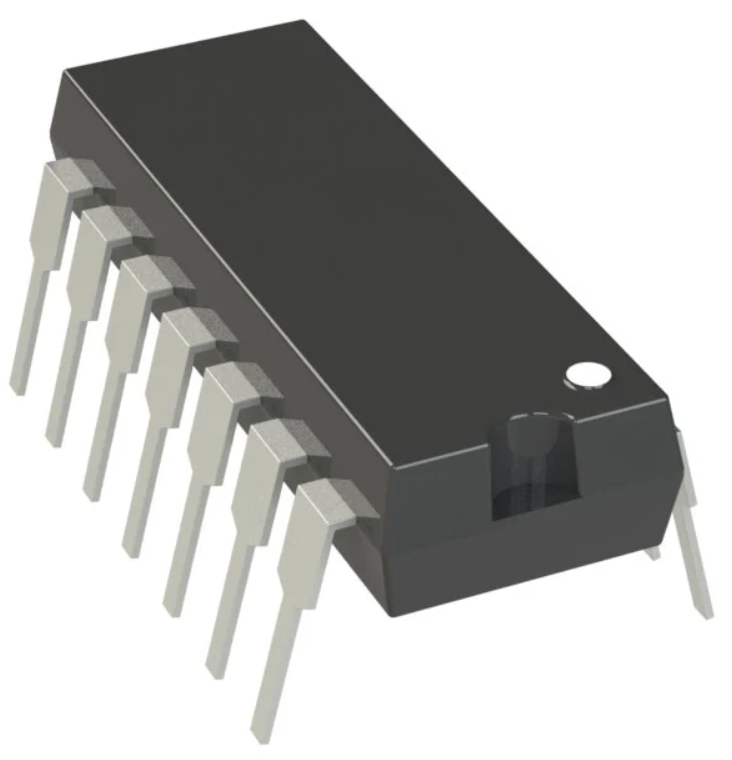
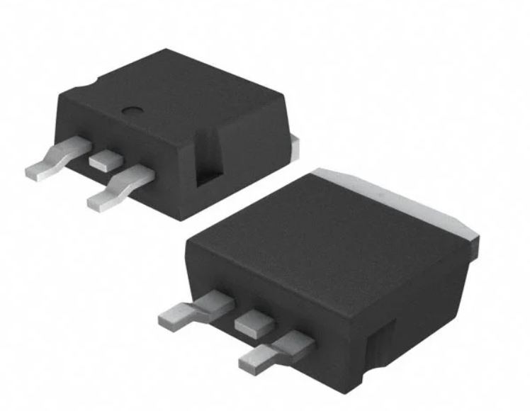

Component Selection for Pressure Sensor Subsystem
---

### Primary Components

*Table 1:  Pressure Sensor Selection*

| **Solution**                                                                                                                                                                                      | **Pros**                                                                                                                                    | **Cons**                                                                                            |
| ------------------------------------------------------------------------------------------------------------------------------------------------------------------------------------------------- | ------------------------------------------------------------------------------------------------------------------------------------------- | --------------------------------------------------------------------------------------------------- |
|  Option 1 -   Angst+Pfister Sensors and Power AG PEWA3403 $49.00/each [link to product](https://www.digikey.com/en/products/detail/microchip-technology/MCP6001T-I-OT/551760?msockid=3979ad89d6b66d210abdbbd5d7bc6c56)                 | \* Robust industrial design \* Handles a wide range of pressures \* Offers pressure control features                                               | \* Relatively expensive \* Overbuilt for simple pressure monitoring. |
|    Option 2 -   \* DFRobot Gravity Analog Water Pressure Sensor  \* $17.50/each  \* [Link to product](https://www.digikey.com/en/products/detail/microchip-technology/MCP6004-I-P/523060?msockid=3979ad89d6b66d210abdbbd5d7bc6c56) | \* Cost effective  \* Handles a greater range of pressure than competitors at the price point   \* Stable output voltage across pressure range | * Datasheet lacks some depth on sensor construction  \* Requires additional thread on main pipe to take measurement |

**Choice:** Option 2 - DFRobot Gravity Analog Water Pressure Sensor

**Rationale:** This sensor leaves greater room in the budget while providing readings for a wider range of pressure. The output voltage works well with easily accesible voltage regulators and there are additional resources on the application of the sensor using other controllers. Given the compatability with similar sized controllers the lack of depth with dimensions can be navigable. This sensor advertises no corrosion and offers clear information on the thread size in the datasheet. 

*Table 2:  Op-Amp Selection*

| **Solution**                                                                                                                                                                                      | **Pros**                                                                                                                                    | **Cons**                                                                                            |
| ------------------------------------------------------------------------------------------------------------------------------------------------------------------------------------------------- | ------------------------------------------------------------------------------------------------------------------------------------------- | --------------------------------------------------------------------------------------------------- |
|  Option 1 -   MCP6001T-I/OT  $0.30/each [link to product](https://www.digikey.com/en/products/detail/angst-pfister-sensors-and-power-ag/PEWA3403-0-0-6-MPa-V6WB2C2/22511405)                 | \* Low Cost  \* Offers the exact number of amplifiers needed  \* Easy to read and highly detailed datasheets                                               | \* Offers less flexibility and room for error than the 6004 \* Pin legs appear to require soldering |
|    Option 2 -   \* MCP6004-I/P  \* $0.59/each  \* [Link to product](https://www.digikey.com/en/products/detail/dfrobot/SEN0257/8341836?s=N4IgTCBcDaIOYCcCGA3AlgFwJ4AIDuSGApgjgA4JEDOVArpTlUQHZUD2CIAugL5A) | \* Cost effective  \* Offers additional non-inverting opamps   \* Designer familiarity with the specific model | * Slightly larger model than the 6001  \* Has a more complex pin layout than the 6001 |

**Choice:** Option 2 - MCP6004-I/P

**Rationale:** There are many of these amps readily available given the materials supplied by the instructors. By having several amplifiers on this componenet there is also increased flexibility in how the circuit can be formatted. In the case of a pin failure the other non-inverting amplifier can be used instead. The cost is also negligble in choosing the 6004 over 6001. Size will not be of concern given the overall space allotted for the PCB.  
*Table 1:  Pressure Sensor Selection*

| **Solution**                                                                                                                                                                                      | **Pros**                                                                                                                                    | **Cons**                                                                                            |
| ------------------------------------------------------------------------------------------------------------------------------------------------------------------------------------------------- | ------------------------------------------------------------------------------------------------------------------------------------------- | --------------------------------------------------------------------------------------------------- |
|  Option 1 -   LM7805T 5V 1.5A Voltage Regulator  $0.33/each [link to product](https://www.digikey.com/en/products/detail/stmicroelectronics/L7805ACD2T-TR/1038230)                 | \* Easily obtainable  \* Extensive information available on design and implementation  \* Short circuit protections                                             | \* Limited applications based on current rating  \* 4% accuracy (More accurate regulators exist) |
|    Option 2 -   \* L7805ACD2T-TR  \* $0.89/two-pack  \* [Link to product](https://www.digikey.com/en/products/detail/dfrobot/SEN0257/8341836?s=N4IgTCBcDaIOYCcCGA3AlgFwJ4AIDuSGApgjgA4JEDOVArpTlUQHZUD2CIAugL5A) | \* Cost effective in a 2-pack  \* Lower quiescent current than the LM7805   \* Thermal Overload Protection | * Surface mount mounting type  \* 10 V minimum input|

**Choice:** Option 2 - LM7805T

**Rationale:** The ease of use, accesss to this specifc voltage regulator and plentiful information troubleshooting and application make the LM7805T a reasonable choice for this subsystem. The minimum input voltage for this regulator is 5 V, which given the barrel jack swich that will be used works perfectly. The L7805ACD2T-TR has a minimum input voltage of 10 V which is too high for the jack. 

