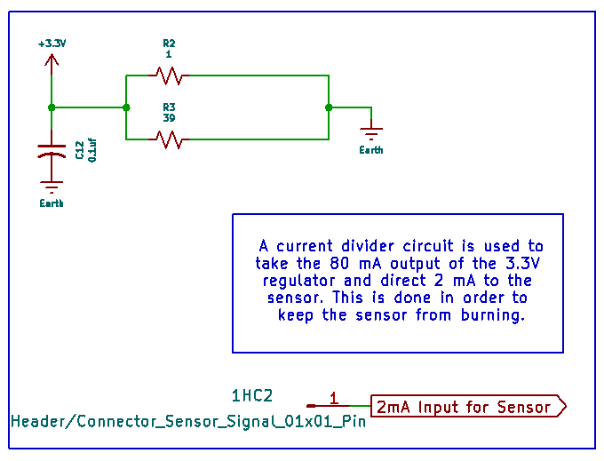

---
Pressure Sensor Subsystem
---

## Overview

The pressure subsystem serves to detect any rapid drops or unusual changes in pessure within a water system. By taking an analog input, amplifying the signal and sending it to the Curiosity Nano Board JECK is able to determine the severity of the situation and output a digital alarm code to the speaker system. The schematic is broken down into four sections: A power supply and regulator combination, the current divider subsection, an amplification and analog pressure sensor subsection as well as a microcontroller processing unit. 

## Power Supply and Voltage Regulation

Within this subsection of the schematic a 9V AC-DC wall outlet adapter is used to bring in power to the Pressure subsystem. From this supply a MIC5211-LXYM6-TR dual voltage regulator converts the input voltage into +3.3V and +5V outputs. Decoupling capacitors are utilized to minimize the noise of the voltage input. The final result is a circuit subsection that can power the amplifier, Curiosity Nano Board and sensor.

## Current Divider 

The output of the dual voltage regulator is 80 mA, however the input for the pressure sensor is 2mA. A current divider is necessary to redirect the difference in current out to ground while diverting 2 mA to the pressure sensor net. Given the input and output currents of the eletrical components the values of the resistors can be calculated using a simple current divider formula. An additional decoupling capacitor is included. A connector is included to bring in 2 mA of current to the sensor in case of component failure.

## Pressure Sensor and Amplification

The CFSensor XGZP6859A040KPG33 Pressure Sensor takes in a pressure reading from a pipe being fed into it and outputs an small analog voltage that is then prepared for reading by the Curiosity Nano Board via amplification. The MCP6004-I/P opamp is powered from the +5V source and outputs an analog voltage between the minimum 0.2V to freshly amplified maximum 5V value. This subsection of the circuit includes various connectors for pressure sensor and 2 mA current inputs in case any components upstream of the amplifier/sensor combination fail. Decoupling capacitors are included to minimize noise. 

